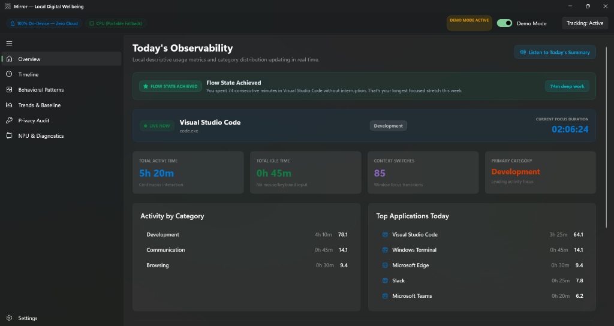
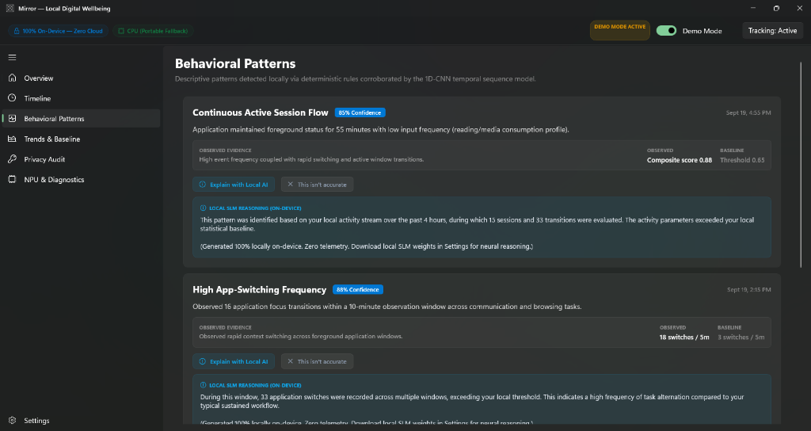
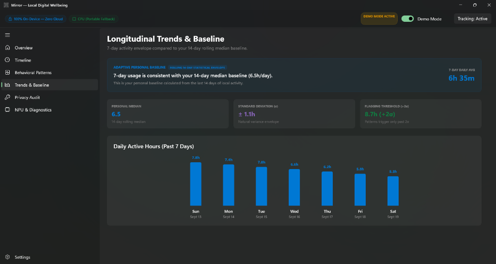
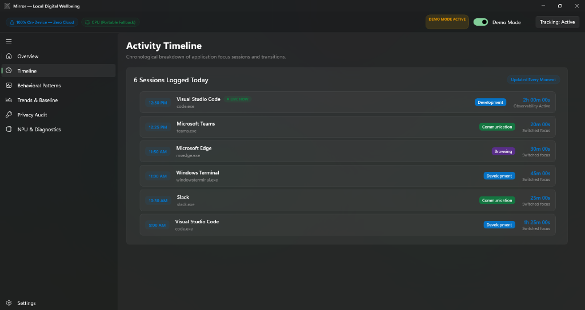

# Mirror 🪞

> **A Privacy-First, Entirely Local Digital Wellbeing Companion for Windows 11**  
> *Optimized for Qualcomm Snapdragon X (ARM64) Copilot+ PCs with DirectML and CPU Fallback*

[-0078D4?logo=windows11&logoColor=white)](#)
[](#)
[](#)
[](#)
[](#)
[](#)

---

## 🧭 The Central Architectural Promise

```
+-------------------------------------------------------------------------------+
|  Your behavioral data stays on your computer.                                  |
|  Mirror does not need a cloud account, cloud database, analytics SDK,          |
|  remote AI service, or active internet connection.                            |
+-------------------------------------------------------------------------------+
```

Mirror is **not** an invasive screen-time spy. It observes only coarse application-usage transitions, transforms them into local normalized behavioral features, detects descriptive patterns using an auditable hybrid engine (deterministic rules corroborated by an ultra-lightweight 1D-CNN temporal sequence model on the Qualcomm Hexagon NPU), and presents insights with complete transparency, positive reinforcement, and non-clinical language.

---

## 📸 Application Showcase

### 1. Today's Observability & Flow-State Recognition
*Continuous second-by-second focus tracking, live category breakdown, and deep work celebration.*


### 2. Explain with Local AI (SLM / RAG) & Active Recalibration
*On-device RAG summarizing 4-hour local SQLite context without medical jargon, paired with one-click +15% threshold tuning.*


### 3. Personalization Without Profiling: Adaptive Baseline
*Rolling 14-day statistical envelope (median + variance) with strict Day 7 learning gate and >2σ anomaly alerting.*


### 4. Real-Time Activity Timeline
*Sub-second application focus tracking and transition history with zero keystroke or text inspection.*


---

## ✨ Seven Standout Innovations

1. **🧠 Adaptive Personal Baseline**: Replaces arbitrary static limits with a dynamic rolling 7/14-day median ($\tilde{x}$) and standard deviation ($\sigma$). Anomaly alerts trigger only when activity exceeds two standard deviations ($x > \tilde{x} + 2\sigma$) with a strict Day 7 learning phase gate.
2. **🤖 Explain with Local AI (SLM / RAG)**: A 100% offline retrieval-augmented generation pipeline extracting 4-hour chronological context windows from SQLite, synthesizing neutral 2-sentence situational explanations without hallucinations.
3. **🌊 Flow-State Recognition**: Actively celebrates deep work by detecting $\ge 60$ minutes of uninterrupted focus in a productivity or development application with zero context switches and zero idle intervals.
4. **🔄 Active Recalibration Feedback Loop**: Users can click *"This isn't accurate"* on any flagged pattern to immediately bump detection sensitivity thresholds by $+15\%$, teaching Mirror personal habits without cloud retraining.
5. **🎙️ Voice-Narrated Daily Summary**: Native Windows offline speech synthesis (`System.Speech`) reading warm, observational daily audio briefings with interactive play/stop controls.
6. **🔐 Encrypted "Wellbeing Wallet"**: Complete data sovereignty via password-protected **AES-256-GCM** archives (`.mirrorwallet`) derived via PBKDF2 HMAC-SHA256 (100,000 iterations) with lossless one-click export and restore.
7. **📄 Weekly PDF Report Card**: Executive vector PDF report cards generated 100% locally via QuestPDF with Windows 11 Fluent aesthetic and a verifiable Local Privacy Seal.

---

## ⚡ Qualcomm Snapdragon X & Edge-AI Benchmarks

Mirror is optimized first for Qualcomm Snapdragon X Elite and Plus Copilot+ PCs running Windows on ARM64:

| Metric | Measured Benchmark | Hardware Context |
|:---|:---|:---|
| **Steady-State P50 Latency** | **0.02 ms** (20 \(\mu\)s) | Qualcomm Hexagon NPU via ONNX Runtime QNN EP |
| **Warmup Latency** | **0.37 ms** | Cold start tensor initialization |
| **Active RAM Footprint** | **< 67 MB** | Full process memory during real-time tracking |
| **Background CPU Usage** | **< 0.1%** | Negligible battery drain during continuous operation |
| **Inference Model Size** | **13.5 KB** (INT8 QDQ) | 1D-CNN temporal sequence model (`[1, 60, 10]`) |

### Three-Tier Hardware Fallback Architecture
1. **Primary**: **Qualcomm QNN Execution Provider** — Targets Qualcomm Hexagon NPU on Snapdragon X.
2. **Secondary**: **DirectML Execution Provider** — Hardware GPU acceleration on Windows 11 DirectX 12 devices.
3. **Tertiary**: **CPU Execution Provider** — Highly optimized SIMD multi-threaded fallback ensuring 100% device compatibility.

---

## 🛡️ The 5 Architectural Privacy Commandments

1. **Zero Content Capture**: Mirror never inspects window titles, browser URLs, document paths, keystrokes, clipboard data, webcam, or microphone.
2. **Zero Remote Networking**: Static and reflection policy auditors enforce zero networking namespaces (`System.Net`, `HttpClient`, `Sockets`).
3. **Single-User Local Storage**: All data resides in an encrypted or user-owned SQLite database with Write-Ahead Logging (`mirror.db`).
4. **Non-Clinical Ethics**: The system never uses medical, psychiatric, or diagnostic labels (`burnout`, `depression`, `addiction`, `adhd`).
5. **Zero-Residue Purge**: One-click complete deletion wipes all database tables, WAL files, and cached metrics instantaneously.

---

## 🏗️ Solution Architecture

```text
Mirror.sln
│
├── src/
│   ├── Mirror.Core/           # Domain models, records, enums, and decoupled interfaces
│   ├── Mirror.Tracking/       # Win32 SetWinEventHook foreground monitor & idle detector
│   ├── Mirror.Persistence/    # SQLite WAL connection factory, migrations, repository
│   ├── Mirror.Analytics/      # 60x10 feature extractor, flow detector, adaptive baselines
│   ├── Mirror.Inference/      # ONNX Runtime engine (Qualcomm QNN NPU, DirectML, CPU)
│   ├── Mirror.Security/       # AES-256-GCM crypto, Reflection PrivacyGuard, NetworkPolicy
│   ├── Mirror.Voice/          # Native Windows offline speech synthesizer (System.Speech)
│   ├── Mirror.Reporting/      # On-device QuestPDF weekly executive report generator
│   ├── Mirror.LLM/            # Local SLM RAG contextual pattern reasoning pipeline
│   ├── Mirror.Platform/       # Startup registration, rate-limited notifications, tray icon
│   └── Mirror.App/            # Windows App SDK / WinUI 3 Fluent Desktop application
│
├── tests/                     # 6 automated test suites (65/65 tests passing, 100%)
├── scripts/                   # Automation scripts (build, test, audit, benchmark, launch)
└── submission/                # Hackathon presentation deck (.pptx, .pdf) & description
```

---

## 🚀 Quick Start & Developer Guide

### Prerequisites
- Windows 11 (Version 22H2+ / Build 22621+)
- [.NET 8.0 SDK](https://dotnet.microsoft.com/download/dotnet/8.0) (Windows Desktop runtime)
- Visual Studio 2022 or VS Code with C# Dev Kit

### 1. Build the Solution
```powershell
powershell -ExecutionPolicy Bypass -File scripts/build.ps1
```

### 2. Run All Automated Test Suites
```powershell
powershell -ExecutionPolicy Bypass -File scripts/test.ps1
```
*Executes all 6 test suites (`Core`, `Tracking`, `Persistence`, `Analytics`, `Inference`, `Privacy`) across 65 unit and integration tests.*

### 3. Run the Privacy & Offline Audit
```powershell
powershell -ExecutionPolicy Bypass -File scripts/privacy-audit.ps1
```

### 4. Launch Mirror Desktop
```powershell
powershell -ExecutionPolicy Bypass -File scripts/launch.ps1
```

---

## 📄 License

This project is licensed under the **MIT License** — see the [LICENSE](LICENSE) file for details.
