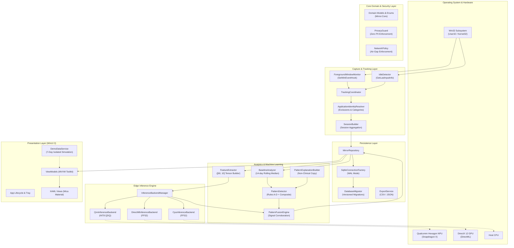
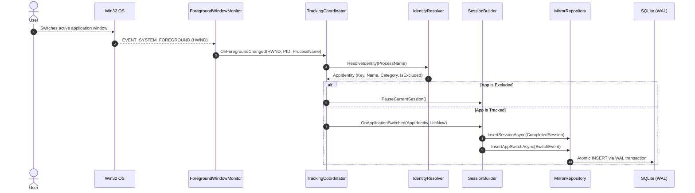
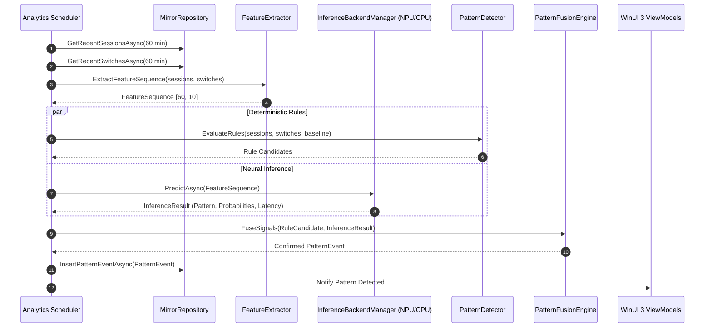

# Mirror System Architecture

This document describes the high-level architecture, component topology, runtime lifecycles, and data flows of **Mirror**.

---

## 1. High-Level Architectural Topology

Mirror is structured as a modular, layered Windows desktop solution adhering to Clean Architecture principles.

---

## 2. Component Breakdown

### 2.1 `Mirror.Core`
The foundational contract assembly:
- **Domain Models**: Immutable C# records (`ActivitySession`, `IdlePeriod`, `AppSwitchEvent`, `PatternEvent`, `DailyMetrics`, `UserSettings`, `FeatureSequence`).
- **Enums**: `TrackingState`, `SessionCloseReason`, `InferenceBackendKind`, `BehavioralPatternType`.
- **Interfaces**: Decoupled contracts (`IMirrorRepository`, `IForegroundWindowMonitor`, `IApplicationIdentityResolver`, `IIdleDetector`, `ISessionBuilder`, `IFeatureExtractor`, `IPatternDetector`, `IInferenceBackendManager`).

### 2.2 `Mirror.Security`
The cryptographic and privacy enforcement gatekeeper:
- **`PrivacyGuard`**: Uses reflection to scan every object written to persistence. Prohibits fields containing `WindowTitle`, `Url`, `Keystroke`, `Clipboard`, `Screenshot`, or `ScreenCapture`.
- **`NetworkPolicy`**: Static and runtime air-gap enforcement. Verifies that no `HttpClient`, `WebClient`, or socket dependencies are referenced.

### 2.3 `Mirror.Persistence`
High-performance, local-only data access layer:
- **`SqliteConnectionFactory`**: Configures SQLite with `PRAGMA journal_mode = WAL`, `PRAGMA synchronous = NORMAL`, and `PRAGMA foreign_keys = ON`.
- **`DatabaseMigrator`**: Versioned schema migrations executed on startup.
- **`MirrorRepository`**: High-throughput atomic transactions, asynchronous batch insertions, time-range queries, automatic retention pruning, and zero-residue database purge.
- **`ExportService`**: Formats local usage into transparent, human-readable CSV and JSON exports.

### 2.4 `Mirror.Tracking`
Low-overhead Win32 event processing:
- **`ForegroundWindowMonitor`**: Installs an out-of-context Win32 hook using `SetWinEventHook` for `EVENT_SYSTEM_FOREGROUND`. Extracts only process ID and executable name.
- **`ProcessResolver`**: Resolves process ID to executable filename with handle safety and process caching.
- **`ApplicationIdentityResolver`**: Maps raw process names to canonical friendly names (e.g. `devenv` -> Visual Studio, `msedge` -> Microsoft Edge), assigns categories, handles user overrides, and excludes private or system processes.
- **`IdleDetector`**: Polls `GetLastInputInfo` periodically (default: 2 minutes of zero mouse or keyboard movement) to halt session accumulation.
- **`SessionBuilder`**: Aggregates continuous foreground segments into cohesive `ActivitySession` records, handling switch, idle, sleep, and shutdown close reasons.

### 2.5 `Mirror.Analytics`
Behavioral feature extraction and hybrid detection:
- **`FeatureExtractor`**: Transforms raw sessions and switches over a 60-minute sliding window into a normalized 2D tensor `[60, 10]`:
  1. Active seconds fraction (`[0..1]`)
  2. Switch count normalized (`[0..1]`)
  3. Unique app count normalized (`[0..1]`)
  4. App reopen frequency (`[0..1]`)
  5. Longest session fraction (`[0..1]`)
  6. Top app dominance ratio (`[0..1]`)
  7. Shannon entropy of app distributions (`[0..1]`)
  8. Late-night binary indicator (`0.0` or `1.0`)
  9. Single-app focus ratio (`[0..1]`)
  10. Category diversity ratio (`[0..1]`)
- **`BaselineAnalyzer`**: Computes a personalized 14-day rolling median of daily active seconds, switch rates, and late-night usage.
- **`PatternDetector`**: Deterministic rule engine evaluating Rules A through D plus Composite Scroll-Like patterns.
- **`PatternExplanationBuilder`**: Produces transparent, non-clinical explanations.
- **`PatternFusionEngine`**: The rule candidate acts as the authoritative gatekeeper; ML inference corroborates and adjusts confidence.

### 2.6 `Mirror.Inference`
On-device neural inference execution:
- **`InferenceBackendManager`**: Orchestrates backend discovery with fallback hierarchy:
  1. **Snapdragon NPU (QNN EP)**: Target execution provider for Qualcomm Snapdragon X Elite / Plus using static INT8 QDQ quantized model.
  2. **DirectML EP**: Hardware acceleration via DirectX 12 for x64/Intel/AMD/NVIDIA GPUs.
  3. **CPU EP**: Deterministic, portable fallback.
- **Truth in Hardware Guarantee**: Reports exact active backend without embellishment.

### 2.7 `Mirror.Platform`
Windows 11 platform integration:
- **`StartupManager`**: Configures auto-start via Windows Registry `CurrentUser\Software\Microsoft\Windows\CurrentVersion\Run`.
- **`NotificationManager`**: Sends rich Windows toast notifications with quiet-hour suppression and rate-limiting.
- **`SystemTrayManager`**: Minimizes Mirror to the Windows System Tray for unobtrusive background operation.

### 2.8 `Mirror.App`
Modern Windows 11 WinUI 3 desktop application:
- Built with Windows App SDK 1.5, Microsoft.Extensions.DependencyInjection, and CommunityToolkit.Mvvm.
- Full Mica material backdrop and native Fluent design.
- Complete navigation pages: Overview, Timeline, Patterns, Trends, Privacy Center, Settings, Diagnostics.
- Built-in 7-Day Isolated Demo Mode.

---

## 3. End-to-End Tracking Sequence

---

## 4. Analytics & Inference Pipeline Sequence

