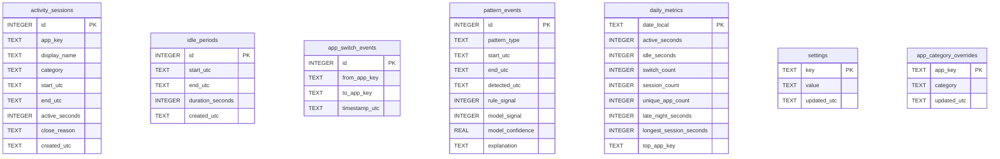

# Mirror Data Model & Local Persistence

Mirror uses an embedded, local **SQLite** database configured for high throughput, zero disk corruption, and minimal write amplification.

---

## 1. SQLite Engine Configuration

To guarantee performance on Windows on ARM64 and SSD storage:
- **`journal_mode = WAL`**: Write-Ahead Logging allows concurrent reads while writes are flushed in the background.
- **`synchronous = NORMAL`**: Eliminates synchronous disk barriers on every transaction while maintaining ACID safety against application crashes.
- **`foreign_keys = ON`**: Enforces relational integrity across parent and child sessions.
- **`temp_store = MEMORY`**: Keeps ephemeral sorting and query tables in RAM.

---

## 2. Entity Relational Diagram

---

## 3. Schema Definitions & Table Specifications

### `activity_sessions`
Records foreground interaction periods.
- `id`: Auto-incrementing 64-bit integer primary key.
- `app_key`: Normalized executable name without directory paths (e.g., `code`, `slack`).
- `display_name`: Human-friendly name (e.g., `Visual Studio Code`).
- `category`: Coarse behavioral grouping (`Development`, `Communication`, `Browsing`, `Entertainment`, `Productivity`, `Utility`).
- `start_utc` / `end_utc`: ISO 8601 UTC timestamps.
- `active_seconds`: Total seconds of active engagement (excluding detected idle intervals).
- `close_reason`: `AppSwitch`, `Idle`, `Lock`, `Sleep`, `TrackingDisabled`, `ProcessExit`, `Shutdown`.

### `idle_periods`
Records periods when no mouse or keyboard input was received past the idle threshold (default: 120s).
- `duration_seconds`: Total seconds the workstation remained unattended.

### `app_switch_events`
Records rapid context switching transitions between apps.
- `from_app_key` / `to_app_key`: Source and destination application identifiers.
- `timestamp_utc`: Timestamp of the switch event.

### `pattern_events`
Stores detected behavioral patterns.
- `pattern_type`: `HighSwitchingBurst`, `ExtendedSingleAppSession`, `LateNightUsageSpike`, `RapidReopenPattern`, `CompositeScrollLike`.
- `rule_signal`: `1` if heuristic rule triggered; `0` otherwise.
- `model_signal`: `1` if ML inference corroborated the rule; `0` otherwise.
- `model_confidence`: Float between `0.0` and `1.0`.
- `explanation`: Human-readable, non-clinical explanation of the pattern.

### `daily_metrics`
Pre-aggregated rollups for fast rendering of trends and charts.
- `date_local`: Local calendar date string (`YYYY-MM-DD`).

---

## 4. Indexing Strategy

To support instant rendering of 7-day, 14-day, and 30-day dashboard queries:
- `idx_sessions_start_utc` on `activity_sessions(start_utc)`
- `idx_sessions_app_key` on `activity_sessions(app_key)`
- `idx_sessions_category` on `activity_sessions(category)`
- `idx_switches_timestamp_utc` on `app_switch_events(timestamp_utc)`
- `idx_patterns_detected_utc` on `pattern_events(detected_utc)`
- `idx_patterns_type` on `pattern_events(pattern_type)`
