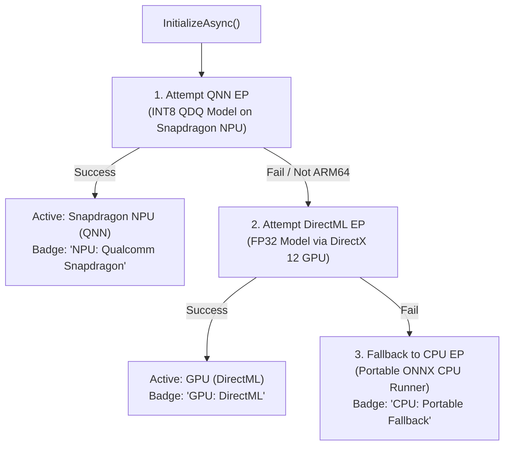

# Qualcomm Snapdragon X NPU Acceleration & Truth in Hardware

Mirror is engineered first for **Windows on ARM64** devices powered by the **Qualcomm Snapdragon X Elite and Snapdragon X Plus** platforms.

---

## 1. Qualcomm Neural Network (QNN) Execution Provider

Snapdragon X devices feature a dedicated 45 TOPS Qualcomm Hexagon NPU. Running neural sequence inference on the NPU ensures:
1. **Near-Zero Power Consumption**: The host Oryon CPU cores remain in deep C-states without waking up or spinning cooling fans.
2. **Sub-Millisecond Inference**: Inference executes in microseconds without competing with foreground user applications for CPU cycles.
3. **Thermal Efficiency**: Zero thermal throttling impact on intensive developer workloads or gaming.

### Architecture in ONNX Runtime
Mirror leverages Microsoft ONNX Runtime with the Qualcomm QNN Execution Provider (`QnnExecutionProvider`):
- Model format: Static INT8 Quantize-DeQuantize (`mirror_pattern_v1.qdq.onnx`).
- Backend configuration: Hexagon HTP backend targeting Snapdragon NPU.

---

## 2. Truth in Hardware Acceleration

A core ethical requirement of Mirror is absolute honesty regarding hardware execution:

> **Mirror will never display "Snapdragon NPU" unless the Qualcomm QNN Execution Provider successfully initializes and executes on the physical Hexagon NPU.**

### Fallback Hierarchy (`InferenceBackendManager.cs`)

### Truthful UI Reporting
On the Main Page, Settings Page, and Diagnostics Page:
- If running on Snapdragon X with QNN loaded: Green badge indicating **"Snapdragon NPU (QNN)"**.
- If running on x64 or GPU fallback: Cyan badge indicating **"DirectML (GPU)"** with the fallback reason stated in Diagnostics.
- If running on CPU: Neutral gray badge indicating **"CPU Execution Provider"** with full transparent explanation.
